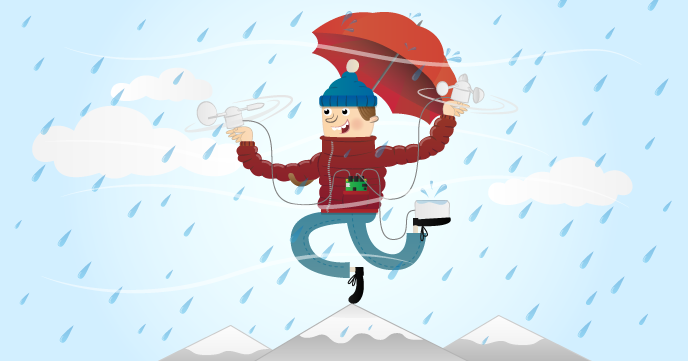

# Sensing the Weather

This scheme of work introduces students to Raspberry Pi Weather Station, a project which aims to get schoolchildren building and programming their own weather station to collect and present data. This is the first of a series of activities which introduces some simple sensors and gets the students writing Python code to gather data from them. 

## Lessons

- [Lesson 1 - Why and how we collect weather data](lesson-1/lesson.md)
- [Lesson 2 - Sensing inputs from hardware](lesson-2/lesson.md)
- [Lesson 3 - Measuring rainfall using polling and interrupts](lesson-3/lesson.md)
- [Lesson 4 - Calculating wind speed](lesson-4/lesson.md)
- [Lesson 5 - Putting it all together](lesson-5/lesson.md)

To find out more about the Weather Station project, the schemes of work, and how to get one, use the following links:

- [The weather station project](http://www.raspberrypi.org/school-weather-station-project/) 
- [Advanced Sensors]()
- [Building a live GUI]()
- [Logging and presenting data]()
- [Working with big data sets]()
- [Deploying your weather station](https://github.com/raspberrypi/weather-station)

## Licence

Unless otherwise specified, everything in this repository is covered by the following licence:

***Sensing the Weather*** by the [Raspberry Pi Foundation](http://www.raspberrypi.org) is licenced under a [Creative Commons Attribution 4.0 International Licence](http://creativecommons.org/licenses/by-sa/4.0/).

Based on a work at https://github.com/raspberrypilearning/sensing-the-weather/
