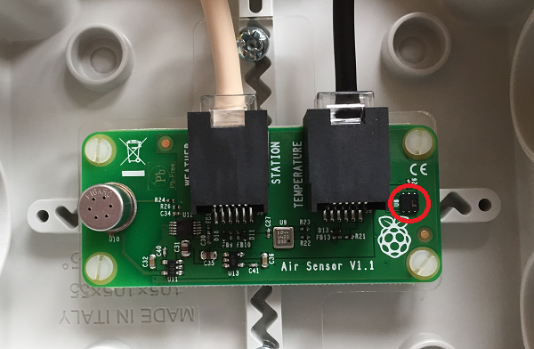

# About the Ambient Temperature Sensor

Here is the ambient temperature sensor component on the Air board included with the Raspberry Pi Weather Station. The component is circled in red.



## How does it work?

This sensor detects both the ambient temperature and the relative humidity of the air surrounding it. We will explore the humidity part of the sensor further in the [lesson on relative humidity](relative_humidity/lesson.md).

These types of sensor detect changes in temperature and humidity in two possible ways depending on how they are built.

**Capacitive sensing** - The sensor uses a material which absorbs water from the air. The sensor's capacitance (ability to store an electric charge) changes depending on how much water vapour the air contains, and this can be measured and converted into meaningful units.

**Resistive sensing** - The sensor uses a material which has the property that its resistance (how easy it is for a current to pass through it) changes depending on the humidity of the surrounding air, and this value is measured and converted into meaningful units. 

Relative Humidity is directly related to the ambient temperature, it is for this reason that we can access both temperature and relative humidity data from the same sensor. Relative Humidity is defined as the amount of water vapour present in the air, as a percentage of the amount of water vapour needed for *saturation* at that temperature. 


For example, at 20&deg;C, the saturated vapour density is 17.3g/m<sup>3</sup>

This webpage has details on [relative humidity](http://hyperphysics.phy-astr.gsu.edu/hbase/Kinetic/relhum.html) which may be interesting further reading, as well as the [data sheet](http://www.mouser.co.uk/pdfdocs/HTU21DF.PDF) for the ambient temperature sensor.

## How does the sensor connect?

1. First, set up your main Raspberry Pi weather station box.
1. The ambient temperature and relative humidity sensor is a component on the air board. Connect the air board to the main weather station with the cable to the port labelled "Air Sensor".#
1. Power on your weather station and log in.

## Sample Code

The following program initialises a HTU21D object to interact with the sensor and takes a single reading of the current ambient temperature. It is important that this code is saved inside the `weather_station` folder on the Raspberry Pi weather station as it requires access to the HTU21D library code which is saved within this folder.

```python
import HTU21D as temp_humid

ambient_temp = temp_humid.HTU21D()

current_temp = ambient_temp.read_temperature()

print( str(current_temp) + " degrees Celsius")
```