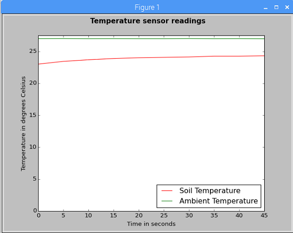

#  Sensing the Weather - Ambient Temperature Sensor Lesson

In this lesson students will learn how to read the ambient temperature from the integrated sensor on the air board, and how to compare this reading with the soil temperature probe.

## Sensor Guide

Background information about the [ambient temperature sensor](about.md)

## Learning objectives

- Be able to write code to read information from the ambient temperature sensor
- Be able to combine two programs together
- Be able to produce a graph to display information from two sensor sources

## Cross-Curricular applications

- Biology - growing crops in a greenhouse environment
- Computer Science - using external modules, combining code
- Physics - resistance, capacitance, evaluating data reliability

## Lesson Summary

- Comparing sensor data from multiple different sensors
- Integrating two programs together

## Starter

Discuss with students the fact that the weather station has two different sensors for sensing the temperature. Why is this, and what might the differences be between the two sensors?

Open up the plastic box containing the air board and point out the ambient temperature sensor - it is very small!

## Main development

1. Students boot their Raspberry Pi weather station with the air board attached. 

1. The aim of the lesson is to use both sensors together to produce a graph of the temperature readings from both sensors at once. An example graph is shown below:

	

1. The [worksheet](worksheet.md) gives students the necessary information to complete the task, but the real aim here is to consolidate students' understanding of the previous lessons. They will work independently to read data from two sensors at once and integrate new code with previous code to check their understanding of the concepts covered so far. 

## Plenary

Ask the class the following questions:

- Are the readings from the different sensors the same? 
- If not, discuss possible reasons why there might be differences in the readings from the different sensors.

**Answers:**

- The readings will probably be several degrees apart
- In our experiment, the reading from the ambient temperature sensor was higher than that of the soil temperature sensor. Possible reasons for the disparity could include the effects of the waterproofing materials on the soil temperature sensor, the effects of the heat generated by the components on the air board on the ambient temperature sensor and the relative measurement accuracy of the two sensors.

## Extension

- Can students apply these skills to create a graph of data from the anemometer?
- How could these sensors be applied to monitor growing crops in a greenhouse environment?
