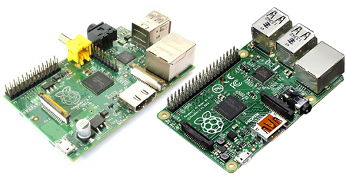
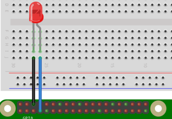

#Snippets

1

*The Raspberry Pi model B (left) and the B+ (right)*

    Those are called General Purpose Input Output pins or *GPIO* for short. These allow the Raspberry Pi to interface with a wide range of electronics and physical objects such as lights, buzzers, motors, robotic arms, servos, relays and sensors.

    Each individual pin can be set up in two main modes: *Input* mode and *Output* mode.

    ## Output mode

    Output mode is used when you want to supply power to a device like an LED or buzzer. The picture below shows how a single LED would be connected.

    

    The blue wire is able to switch the positive leg of the LED on/off. The black wire connects the negative leg of the LED to GND (ground) to complete the circuit. The LED will not light up though unless we give the computer the command to make GPIO 4 output power. We'll look into these commands later the point to understand is that we have *control* of the LED turning on and off from our code.

    ## Input mode

    If we use *input* mode, a GPIO pin has a value that we can read in our code. If the pin has voltage going into it, the reading will be `1` HIGH; if the pin was connected directly to ground (no voltage), the reading will be `0` LOW. The picture below shows how a push button would be connected. In our code we want to know if the button has been pressed or not. To do this we can use a clever trick to loop back some power from the Raspberry Pi, through the button and into a GPIO pin that is using input mode.

    

    The red wire is being used to connect one side of the button to the 3.3 volt supply of the Raspberry Pi (a pin that always outputs 3.3 volts by default). The blue wire connects the other side of the button to GPIO 4. The button works like a switch, so while it's up (open switch) no voltage will reach GPIO 4 so the reading will be `0` LOW. When the button is pressed (closed switch) voltage will flow into GPIO 4 whereupon on the reading will be `1` HIGH.
