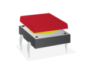
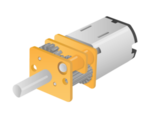
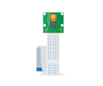
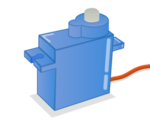
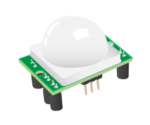
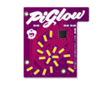
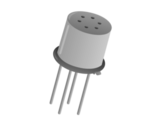
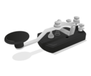
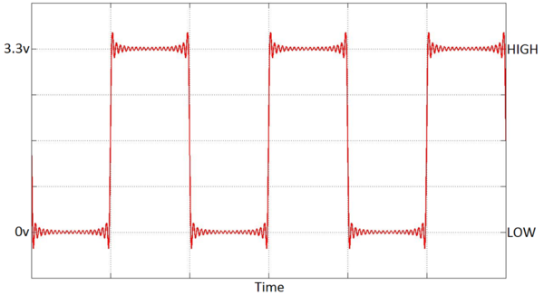

# Weather Station Basic I/O - Weather Forecasting

In this lesson you will:

- Ensure you are familiar with how weather forecasts work, and with some key weather terminology
- Identify some weather characteristics that can be measured, and understand how this is done
- Understand what a Raspberry Pi is, and how it can be used as an automated weather station
- Learn the difference between the input and output modes of the GPIO pins, and the terms `HIGH` and `LOW`

## What does a weather forecast tell us

All of us at some point have seen a TV weather forecast, but what does it all mean? Watch the video and see if you are able to explain some of the key terms below.

What do the following terms mean?
- High Pressure
- Low Pressure
- Isobars
- Fronts

## How do we make predictions?

So, a weather forecast is a useful prediction of future conditions, but how are these predictions made?

There are two key steps to predicting the weather:

### Data collection
  Vast quantities of data are collected about current conditions all over the world. This is done using:
  - Satelites
  - Ground-based observers
  - Weather stations

  What kind of data might these sources collect? Temperature is one, but can you think of others?

### Modelling
  The data collected is gathered and used to build a computer model which knows the state of the weather at various points, and predicts the path of weather fronts and systems.

  Explore these models by visiting [weatheronline.co.uk
](http://www.weatheronline.co.uk/cgi-app/weathercharts?LANG=en&CONT=ukuk&MAPS=vtx)

## Are predictions always accurate?

- Create a [weather log](files/weather_log.pdf) and record the predicted conditions (temperature, wind speed, etc) in your area using your favourite forecasting service.

- Observe the weather for a week and record the actual conditions ([weather online](http://www.weatheronline.co.uk/weather/maps/current?LANG=en&CONT=ukuk)). How accurate were the forecasts?

## Building a computerised weather station

Forecasting relies on regular, reliable data collection, which is ideally done by an automated computer system. This is where the Raspberry Pi is perfect: it's small, light, cheap, and best of all it can collect data from sensors. Along with the weather station add-on we can build a complete automated weather station.

The Weather Station HAT includes a variety of sensors:
- rain guage
- anemometer
- wind vane
- temperature
- pressure
- air quality

What do each of these sensors measure? In which units?

## Inputs and outputs

The Raspberry Pi is able to communicate with these devices using a series of pins on the board called **G**eneral **P**urpose **I**nput **O**utput (**GPIO**) pins. These pins allow the Raspberry Pi to control **output** devices and sense data using **input** devices.

Can you decide which of these devices are input and which are output?

| Component | Image | Component | Image |
|------|-------|------|-------|
| Button |   | LED |  |
| Motor |   | Reed Switch |  |
| Camera |   | Servo |  |
| Anemometer |   | Infrared Sensor |  |
| PiGlow |   | Air Quality Sensor |  |
| Morse Key |   | | |

## Thinking digitally

When the Raspberry Pi connects to devices like the ones above it communicates with them using an electrical signal which can either be `HIGH` (maximum voltage) or `LOW` (minimum voltage).
- When talking to an **output** device the Raspberry Pi can send a `HIGH` signal giving that device **3.3V** or a `LOW` signal which gives it **0V**
- When talking to an **input** device the Raspberry Pi can detect a `HIGH` signal when that device allows **3.3V** to pass through. Otherwise if the device allows **0V** to pass through the `LOW` signal is detected.

Here is a chart showing the voltage across a device connect to the Pi

Now answer the following questions:

1. What would be happening if this graph was from an LED being connected to the Pi?
1. What would this graph show if instead the Pi was connected to a button?

## What next?
In this lesson we have considered how weather is measured and forecast, how the Raspberry Pi could be used to capture data, and the difference between `input` and `output` mode.
- How do the devices in the weather station kit sense data? How might this be detected by the Pi?
- Are there any sensors for which the `HIGH` and `LOW` readings aren't clear or don't work? For example, how does the weather vane work? In this case, what is `HIGH` and what is `LOW`?
- Have a go at some simple GPIO activities from the [Make](https://www.raspberrypi.org/resources/make/) section of the Raspberry Pi website.
