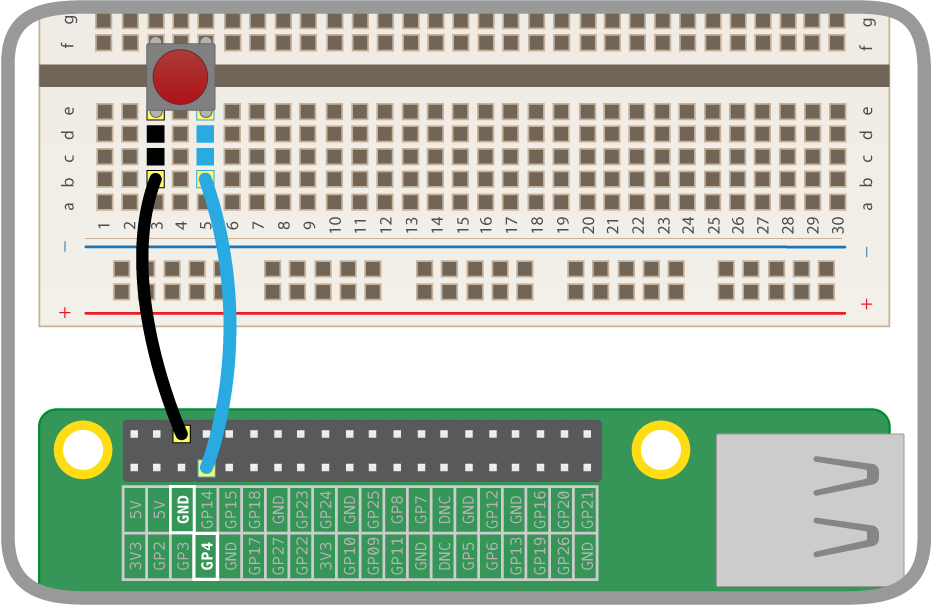

# Weather Station Basic I/O - Detecting input 

In this lesson you will:

1. Create and execute a program to get the current state of pin 4 and display it on-screen
2. Use a `while` loop to repeat this **polling** of the pin and output the result
3. Add a delay to slow down the rate of polling
4. Adapt the program to use a pull down circuit
4. Explore the timings of the loop to get the ideal sensitivity

## Connecting a button
Before we start working with the weather station kit, we are going to ensure we can capture a simple input signal. To do this we need to connect a button to one of the GPIO pins.

1. Follow the [button guide](http://raspberrypi.org/guides/gpio/button.md) to connect a single button to **Pin 4**.



## Sensing the input

2. Set up your Raspberry Pi and ensure you are in Desktop mode.

3. Launch the LXterminal window


4. Create a directory by typing `mkdir weather_station` follow by `enter`

5. Create an empty program file called pullup.py by typing `sudo idle3 weather_station/pullup.py`

6. Enter the following code:

```python
#!/usr/bin/python3
import RPi.GPIO as GPIO
import time

pin = 4

GPIO.setmode(GPIO.BCM)
GPIO.setup(pin, GPIO.IN, GPIO.PUD_UP

pin_value = GPIO.input(pin)
if pin_value == True:
  print ("HIGH")
else:
  print("LOW")
```

7. To run your code, press the **F5** key on your keyboard: you will be asked to save, then an extra window will pop up and should print either `HIGH` or `LOW` depending on whether the button is pressed or not.

### Code explained:

  ```python
  #!/usr/bin/python3
  ```

This line denotes the file as a Python program so that the computer knows *how* to run the code.

  ```python
  import RPi.GPIO as GPIO
  import time
  ```

This imports the `RPi.GPIO` library that allows you to control the GPIO pins, and the `time` library to measure time or make the program sleep.

  ```python
  pin = 4
  GPIO.setmode(GPIO.BCM)
  GPIO.setup(pin, GPIO.IN, GPIO.PUD_UP)
  ```

These three lines set up a variable call pin to store the pin number. We then set the scheme for referring to our pins as the BCM scheme. The important bit is the third line, where we set up the pin as an input using a pull up resistor.

   ```python
   pin_value = GPIO.input(pin)
   ```

This line reads the state of the pin and stores the result in a variable called `pin_value`. This will either be *True* or *False*.

    ```python
    if pin_value == True:
      print ("HIGH")
    else:
      print("LOW")
    ```

These lines check the value of the `pin_value` variable, and will print out `HIGH` if the value is **True** and `LOW` if the value is **False**.

So now we can check the state of the button, but only once.

## Repeatedly Polling
Now that we can check the state of the button we ought to check continously and report its state. We can do this by **Polling** the pin every 0.5 seconds and constantly outputting the state.

For this we need to add an infinite loop to our code. In Python we use a **while True:** statement and indent all the code that will be looped.

1. Change your program to put the last 4 lines inside a while loop and add a 0.5 second delay like this:

```python
while True:
  if pin_value == True:
    print ("HIGH")
  else:
    print("LOW")
  time.sleep(0.5)
```
2. Check your code against this [solution](code/pullup.py) to ensure it is correct.
3. Run you code again by pressing **F5**, to exit the program press `Ctrl + C` on your keyboard.
4. You should see `HIGH` when the button isn't pressed and `LOW` when it is pressed.

## Getting the timing right

So now you've managed to check the status of the input pin over and over. Does it always work though?

1. Try running your program again and press the button continuously. Can you press it fast enough that the Pi fails to detect some presses?
2. The fact that the program only checks every 0.5 seconds means that some presses aren't detected.
3. Adjust the timing of the program by changing the number in the line
`time.sleep(0.5)`

Think carefully about whether you want to increase this number or decrease it. Adjust it until it's sensitive enough.

## Using a pull down circuit

In our program we have used what's called a pull up resistor, which ensures the pin reads as `HIGH` until the button is pressed at which points the voltage drops and the pin reads `LOW` (For a more detailed explanation see the [Pull up / Pull down Guide](http://raspberrypi.org/guides/GPIO/pull_up_down.md))

Let's see what the difference is when we use a pull down resistor.
1. From your pullup.py program in IDLE click the **file** menu and select **save as**, replace the file name with `pulldown.py`

2. Change the wiring of your button to a **pull down** circuit as shown here.


3. Update the code to use a pull down circuit rather than pull up, this is a single change on the line that reads
`GPIO.setup(pin, GPIO.IN, GPIO.PUD_UP)`
which should become
`GPIO.setup(pin, GPIO.IN, GPIO.PUD_DOWN)`, your code should now look like [this](code/pulldown.py)

## What next?

In this lesson we have made our program respond to a single button press using a pull up and pull down setup.

- Are either of these circuits better than the other? Does it make a difference which one we use?
- In our code we used a button to print a simple statement. What else could you make it do?
- Could you connect multiple buttons to your Raspberry Pi and detect the states of each? Could you count the number of button presses?
