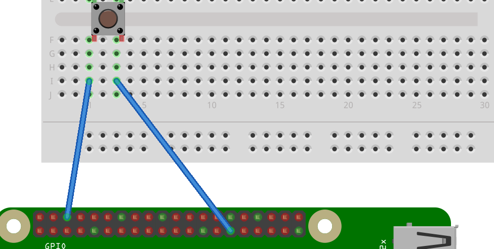
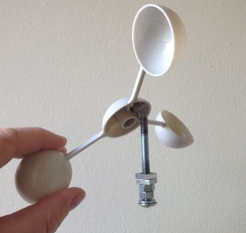

### Setting up your Pi

1. Connect your Pi up to the weather station add-on board and ensure the anemometer is connected to the weather station via the port marked "WIND".
1. Pupils are not likely to have their own weather station, and so will have to connect their Pi to some wires or a button to simulate the weather station signal pulses.



### Detect the interrupts

Before starting, get students to open their rain gauge code and remind them what an **interrupt** is and why we might use them in place of **continuous polling**.

The first thing students need to do is adapt their rain gauge code to make it gather data from the anemometer instead.

1. Copy the code from last lesson's rain gauge and rename it as `wind_speed.py`:

	```bash
cp rain_interrupt.py wind_speed.py
```

1. Edit the code with nano:

	```bash
nano wind_speed.py
```

1. There are four changes to be made. Firstly, change the pin from 6 to 5. Then change the name of the function from **bucket_tipped** to **spin**. Remove the multiplier for rainfall and just print the count. Finally, change the function name in the event detection line to match the **spin** function.

1. Their code should look like this:

	```python
	#!/usr/bin/python3
	import RPi.GPIO as GPIO

	pin = 5
	count = 0

	def spin(channel):
	    global count
	    count = count + 1
	    print (count)

	GPIO.setmode(GPIO.BCM)
	GPIO.setup(pin, GPIO.IN, GPIO.PUD_UP)
	GPIO.add_event_detect(pin, GPIO.FALLING, callback=spin, bouncetime=300)

	input("Press enter to stop logging\n")
	```

1. This will count the number of signals from the sensor and display the total on screen. There should be a signal detected each time the wires are connected, or for 1/2 a revolution.
1. Test the code by saving with `Ctrl + O` , exiting with `Ctrl + X` and then running:

	```bash
sudo ./wind_speed.py
```

### Calculate wind speed

After successfully testing the code, the students need to convert the `count` variable into speed. Discuss how this might be done with the students. Try to elicit the following steps:

1. To calculate speed we need to use the formula **Speed = Distance / Time**.
1. **Time** is the easy bit as we can just decide how long to wait for before checking the number of signals detected; in our example we'll use 5 seconds.
1. **Distance** can be found from the number of signals counted by the code. Each signal marks 1/2 a revolution which is equal to **π x r**.
1. The radius can be measured as **9cm** which gives us a half rotation distance of **28.278cm**.
1. So speed can be calculated by **Speed = π x radius x count / 5**.
1. This will give us a speed reading  in **cm per second**; we need to convert this to **km per hour**.
1. First, we need to divide by 10000 to convert from **cm** to **km**.
1. Then we need to convert from **seconds** to **hours** by multiplying by 3600.

### Coding the solution

Give the students an outline solution in pseudocode / structured English or similar, for example:

> import GPIO, time, math  
> pin 5  
> count = 0  
>
> FUNCTION spin (channel)  
> --- increment global count variable  
> --- display count  
>
> FUNCTION calcspeed  
> --- using r = 9cm, t=5sec, count and math.pi  
> --- calculate windspeed in km / h  
> --- return windspeed  
>
> Set up GPIO and interrupt which has spin as its callback function.  
>
> LOOP  
> --- reset global count to 0  
> --- wait 5 sec  
> --- call calcspeed to get value  
> --- display windspeed value  


Ask the students to try and code the solution, using the above as a template. Encourage students to collaborate, test, and use trial and error to finish the task. A solution is provided here for reference:

```python
#!/usr/bin/python3
import RPi.GPIO as GPIO
import time, math

pin = 5
count = 0

def calculate_speed(r_cm, time_sec):
    global count
    circ_cm = (2 * math.pi) * r_cm
    rot = count / 2.0
    dist_km = (circ_cm * rot) / 100000.0 # convert to kilometres
    km_per_sec = dist_km / time_sec
    km_per_hour = km_per_sec * 3600 # convert to distance per hour
    return km_per_hour

def spin(channel):
    global count
    count += 1
    print (count)

GPIO.setmode(GPIO.BCM)
GPIO.setup(pin, GPIO.IN, GPIO.PUD_UP)
GPIO.add_event_detect(pin, GPIO.FALLING, callback=spin)

interval = 5

while True:
    count = 0
    time.sleep(interval)
    print (calculate_speed(9.0, interval), "kph")
```

At any point the students can run their code by exiting nano with `Ctrl + O` followed by `Ctrl + X`, then typing `sudo ./wind_speed.py`.


### Calibration

Calibration is the practice of adjusting the value reported by a sensor to match a scientifically known value. In order to do this for the anemometer, you would need a wind tunnel in your school where you could control the wind speed to an exact value. Since most of us don't have this available we'll need to try something else.

Generally speaking, anemometers tend to report the wind speed slightly lower than it actually is, a problem which gets progressively worse as the wind speed increases. Students should follow the instructions in the worksheet to make a small adjustment to their reported value.

In order to get a more accurate reading, the figure our program calculates needs to be multiplied by a factor of **1.18**. The final line of the `calculate_speed` function should now read :

```python
return km_per_hour * 1.18
```

Students should follow the instructions to implement this change and test the output of their code.


Show pupils the anemometer and ask them to consider:
- What does the device measure?
- How might it work?
- What unit of measurement might it use?
- How would we capture data from this device in our code?

To help explain how the device works, you can dismantle it following these steps:
1. First, hold the base in one hand and pull on the blades/cups with the other hand. It doesn't need much force to come off.

1. Look at the underside of the blades/cups and you'll see a small metal cylinder on one side. This is a magnet, just like the one found on the bucket of the rain gauge. Test it with a paper clip if you like.

	

1. Now use a screwdriver to remove the three screws on the bottom of the base. The base should then pop out easily. Slide it down the cable about 10 to 20 cm to get it out of the way. Now if you look inside you'll see our old friend the reed switch again.

	

1. So what does this mean? When the blades/cups are in their original position and spinning, the magnet will rotate in a tight circle above the reed switch. So for every complete rotation there will be two moments when the switch is closed.

1. So, using a similar programming technique to the rain gauge, we can count the number of interrupts and divide it by two to give us the number of complete rotations.

1. Reassemble the anemometer. Put the base back into position and ensure the knot in the cable remains inside. Replace the three screws and push the blades/cups back onto the top. Give it a spin to check it rotates correctly.
