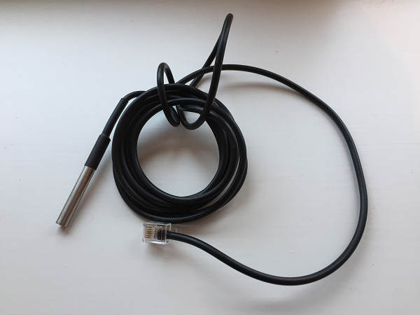

# Sensing the Weather - Soil Temperature Worksheet

Today you will be learning about the soil temperature sensor.



In this lesson you will:

- Connect up the sensor and take a reading
- Store multiple readings from the sensor
- Use Python to plot a graph of your temperature sensor readings

## How does the soil temperature sensor work?

Your soil temperature probe is a prewired and waterproof digital temperature sensor. If you were to take the sensor out of the protective wiring and waterproofing, it would look like this:


The sensor has three pins: a ground pin, a data pin, and a 3.3V power pin. You may have noticed that the sensor was described as a *digital* temperature sensor; this is because the signals generated are converted into a digital format that the Raspberry Pi can understand.

To initiate a temperature measurement, the Raspberry Pi sends a command to the sensor. Then the resulting thermal data is stored in a temperature register in the sensor memory for the Raspberry Pi to read.


## Taking a reading

1. Set up and boot your Raspberry Pi Weather Station, including the smaller box which contains the air quality sensor board and to which the soil temperature probe is connected.

1. The first thing we need to know is how to take a simple reading from the temperature sensor. Remember when we used someone else's code to help us access the data from the [wind vane](../lesson-4/worksheet.md)? The temperature sensor also has some prewritten code we can use; it has a bit of a confusing name because the actual name of the temperature sensor component is **DS18B20**. This code creates an object `temp_probe` we can use to talk to the sensor, and then calls the method `read_temp()` on this object to get the current temperature reading.


	```python
	import ds18b20_therm as soil_temp

	temp_probe = soil_temp.DS18B20()
	print( temp_probe.read_temp() )
	```

1. Now think back to the [wind gust speed lesson](../lesson-3/worksheet.md) where we took multiple readings from the anemometer and stored the speeds in a list. Can you work out how to take 10 readings and store them in a list? You might want to use your [old code](../lesson-3/code/wind_gust.py) to help you.

1. It's not much use to us if we take temperature readings immediately one after the other. Can you work out how to space the readings at an interval of 5 seconds? Your first step is to add the code `from time import sleep` at the start of your program so you can use the `sleep()` function to help you.

1. Here is the [finished code](code/soil_multi_readings.py) if you get stuck or want to check your answer.

## Plotting a graph

### Question

Which type of graph would best show the data we have gathered from the temperature sensor?

### Answer

A line graph would be the most suitable graph to show this data, as it shows the change in temperature over time.

Python has a software library called `matplotlib` which allows us to easily create graphs of our data. Ask your teacher whether you need to install this library or if it has already been done for you. If you need to install the software, open up a terminal and type `sudo apt-get install python3-matplotlib`.

1. You have already written code to generate a list of 10 temperature readings and store them in a list. Rename the list to `y` as it contains the values that will be plotted on the `y` axis of your graph.

1. To be able to build a graph, we also need some values for the `x` axis of our graph. These values should represent the points in time when we took a sample. In your code, you took a temperature reading every 5 seconds, so our `x` axis values should look like this:

	```python
	[0, 5, 10, 15, 20, 25, 30, 35, 40, 45]
	```

We could just write these out, but there is a much easier way using a Python feature called a **list comprehension**. Examine the following code:

	```python
	interval = 2
	x = [i for i in range(0, 10, interval)]
	print(x)
	```

What do you think the output will be? Type this code into a blank Python file and find out!

Using this as an example, can you write some code to generate a list which looks like the `x` axis values we want (from 0 seconds to 45 seconds, with a value every 5 seconds)?

1. Combine your list comprehension code with the code you already wrote and it should look a bit like this:

	```python
	import ds18b20_therm as soil_temp
	from time import sleep

	interval = 5
	temp_probe = soil_temp.DS18B20()
	x = [i for i in range(0, 10*interval, interval)]
	y = []

	print("Taking 10 readings, one every " + str(interval) + " seconds...")

	for i in range(10):
	    y.append(temp_probe.read_temp())
	    print("Reading " + str(i) )
	    sleep(interval)
	```

1. Now for the surprisingly easy part: creating the graph! Add this line at the top of your program to import the `matplotlib` library:

	```python
	import matplotlib.pyplot as plt
	```

1. Now to generate the graph! At the end of your code, add these lines of code:

	```python
	plt.plot(x,y)
	plt.show()
	```

This tells the graph code (which we have nicknamed `plt`) to call its `plot()` function using the `x` and `y` lists as the data, and then to call the `show()` function to display the graph on the screen.


1. Test your code; you can cause temperature variations by simply holding the sensor in your hand to warm it up. The full [code with the graph](code/soil_temp.py) is here for you to look at.

1. Your graph doesn't have any axis labels or a title. Can you work out how to add these using the `matplotlib` functions `suptitle("Title")`, `xlabel("x axis label")`, and `ylabel("y axis label")`?

	

The answer is [here](code/soil_fancy_graph.py) if you get stuck.

## Summary

- In this lesson you recorded multiple readings from the temperature sensor, spaced at even time intervals
- You have used Python to automatically generate a graph of your results


## What next

- Can you alter the program to make it possible to customise the number of readings taken by the sensor? At the moment the sensor will always take 10 readings, but could the user type in how many readings they want?
- Could the user specify the interval they would like to sample at?
- Can you work out how to save your graph as a PDF using functions from the `matplotlib` documentation?
