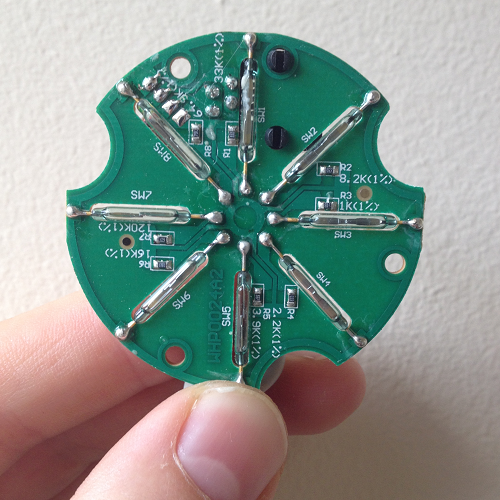

# Sensing the Weather - Wind Direction Worksheet

In this lesson you will:

- Understand how the wind vane uses reed switches to change its output voltage
- Understand the difference between an analogue and a digital signal
- Be able to write a program to output the wind direction based on input from the wind vane

## How does the wind vane work?

A wind vane shows the direction *from which* the wind is coming, not where it's going (this can be confusing because TV weather maps show the opposite). It works by the wind exerting force on a vertical blade which rotates to find the position of least resistance, this position is then aligned with the direction of the oncoming wind.

The wind vane is the more complex than the [rain gauge](../rainfall/about.md) or [anemometer](../wind_speed/about.md). It does use reed switches and magnets but it works in a completely different way. 

If you look inside the wind vane, you'll see there are eight reed switches arranged like the spokes of a wheel. 



So what is going on here? Firstly we need to understand what a [resistor](http://en.wikipedia.org/wiki/Resistor) is. These are small components that resist/reduce the flow of electrical current but do not stop it, at the same time they also reduce the voltage moving through the circuit. Resistors can have different values, a low resistance value would let almost all voltage/current through but a high resistance value would let very little through. There are eight resistors in the wind vane, and as the magnet rotates, different reed switches will open and close and thus switch their corresponding resistor in and out of the circuit.

Each of the eight resistors have different values which you'll see printed in white text next to them (e.g. you can see 8.2K on the right), this then allows the wind vane to have 16 possible combinations of resistance since the magnet is able to close two reed switches when half way between them. More info in the [datasheet](https://www.argentdata.com/files/80422_datasheet.pdf).

## Analogue vs Digital

We record a voltage from the wind vane which varies according to which combination of resistors is currently being switched into the circuit. This is an *analogue* signal because it records a **range** of voltages. When we used the anemometer it simply reported a `HIGH` or `LOW` voltage - all or nothing which is a *digital* signal. This means we need a special component called an Analogue to Digital Convertor (ADC) to allow us to observe this signal as a number - the signal is *analogue* and our Raspberry Pi is a *digital* machine. The weather board inside your weather station has an ADC built in.

## Using the wind_direction module

Reading information from the ADC is a little tricky, so we are going to use a **module** which contains code someone else has written. 

1. Set up your Raspberry Pi weather station.

1. Launch the terminal

    

1. Move to the `weather station` directory by typing `cd weather_station` and pressing `enter`

1. Start a new Python program by typing `sudo idle3 find_wind_direction.py`. It is important that your program is in the `weather_station` directory as this is where the module we need is stored. 

1. First, let's import the module. Type this code in to the start of your Python program:

```python
import wind_direction as wind_vane
```

This code tells Python to get the contents of the `wind_direction` module, and that when I refer to things from this module I want to refer to them by the name `wind_vane`. 

1. Now we need to create an **object** which will allow us to gather readings from our wind vane.

	```python
	our_wind_vane = wind_vane.wind_direction(0, "wind_direction.json")
	```

1. Now we need to specify the interval to sample the wind direction in, and then get the direction:

	```python
	interval = 10
	print( our_wind_vane.get_value(interval) )
	```
	`get_value()` is a method which is called upon the `our_wind_vane` object which returns a value in degrees for the direction of the wind vane. 

1. By placing this code inside a `while True:` infinite loop, we can repeatedly sample the wind direction at 10 second intervals. The finished code so far should look like this - save it and run the code while pointing your weather vane in different directions to see if it works.

	```python
	import wind_direction as wind_vane

	while True:

	    our_wind_vane = wind_vane.wind_direction(0, "wind_direction.json")

	    interval = 10
	    print(our_wind_vane.get_value(interval))

	```


## Part 2 title

### Question
A question

### Answer
The answer

More instructions


Finished code

## Summary

- Questions to think about

## What's next

Ideas for things to do next